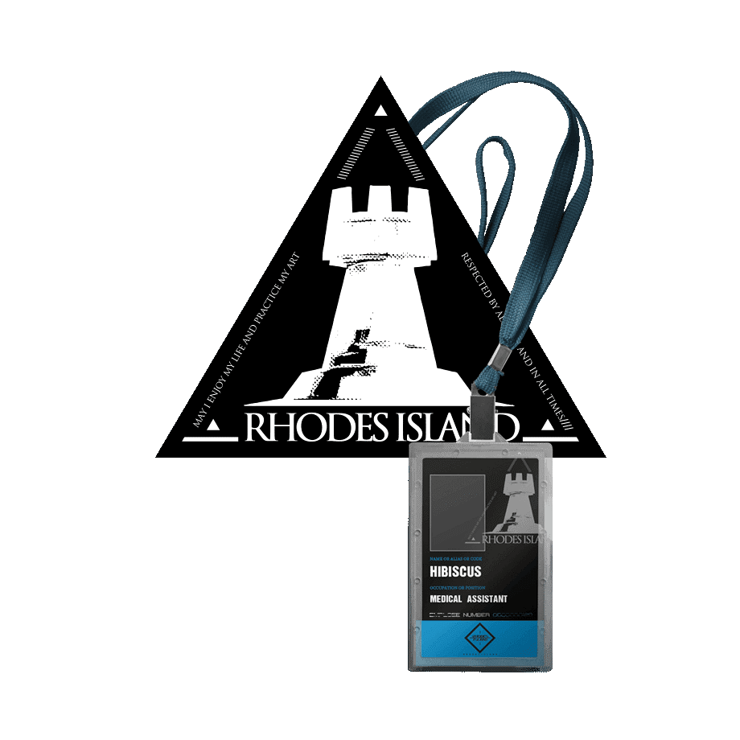
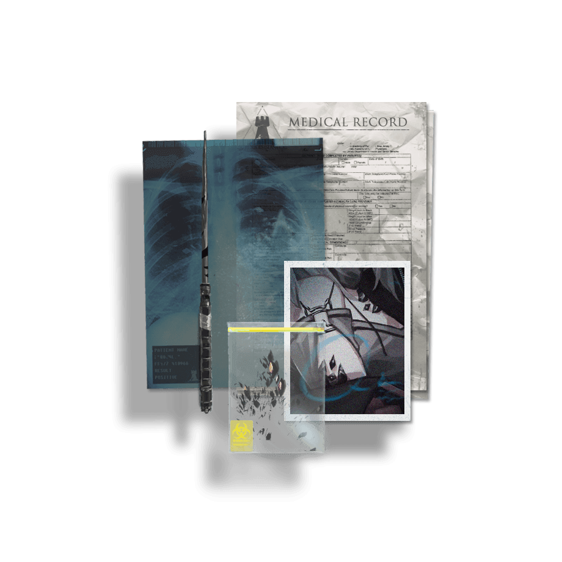

# 创建干员

大地被起因不明的天灾四处肆虐，经由天灾席卷过的土地上出现了大量的神秘矿物——被人们称为“源石”。虽然源石的发现历史已久，但是依赖于技术的进步，其蕴含的能量投入工业后使得文明顺利迈入现代，与此同时，源石本身也催生出“感染者”的存在。

被源石所感染的人。理论致死率100%，死亡时存在扩散传染性以及潜在危险能力，是各国隔离驱逐的目标。长久以来，没人告诉他们该如何渡过余生，如今伴随着一位颠覆者的出现，越来越多的感染者被纳入一场名为“整合运动”的反抗浪潮。

作为一个无种族立场，极端排外的感染者组织，整合运动宣称感染者"应对自己的身份感到骄傲，积极去获取并使用属于自己的力量"。试图用最原始的手段去争夺世界的公正。以某座被摧毁的伟大城市为开端，医疗机构“罗德岛”的突然介入，令整个事态向着未知发展。

罗德岛制药公司作为感染者问题专家，聘用感染者，深入危险地区，通过种种手段，已经成功解决了数起感染者引发的事件。而今，我们将面对史无前例的感染者暴乱。在各个势力间游走、发掘不为人知的内幕、抵挡整合运动的疯狂进攻、这便是你将来可能面对的挑战。

不管你是迷茫而不知方向，或是抱着某种清晰的目标，**欢迎来到罗德岛，干员。**

## 在创建你的干员之前

在这个规则中，你将作为一名玩家（PL）扮演一名隶属于罗德岛的行动干员，与你的小队成员们一同完成博士派发的各种任务。这或许是赶赴切尔诺伯格援救无助的平民，踏上喀兰的雪峰验明未知的秘闻，抑或是协助驻守龙门的近卫局抵挡整合运动的进攻。而一名游戏主持人（GM）将会为你叙述这些故事，并为你的干员的各种行动做出判定。

相比于制作原作游戏中的干员的复制，本规则更希望PL通过思考与创造来创建属于自己的干员。不同的人物卡会在游戏中给你带来截然不同的体验，而更加丰满的角色也会让你的体验更加有层次感。作为创建干员的参考，你可以先构想好以下的问题，这会帮助你更加理解自己的干员在游戏中的位置：

- 干员的[**种族**](#种族)：这名干员是一个萨卡兹人还是一个乌萨斯人？

- 干员的[**职能**](#职能)：这名干员在小队中负责哪一方面的任务？

- 干员的[**出身**](#出身地)：在加入罗德岛之前，这名干员拥有怎样的经历？

### 职能

不论是作为一个TRPG，还是从《明日方舟》原作游戏的角度来说，参与游戏的每一个人都希望在故事中能够出现特点突出、个性鲜明的角色；而每一名游戏中的角色，都应当在故事中发光发热。在决定好方向之前，先试着与其他玩家进行更多的交流，建立好分工关系——不论是战斗方面还是社交方面。这是创建你的干员角色档案内容的基础，也将是你们能否成功完成一个任务的关键所在。

有些时候，根据特定的职能来创建干员是一个相当不错的主意。你可以将职能理解为游戏定位，或是更加狭义的职业。理想情况下，一个全面的小队中需要有尽可能多的拥有不同职能的干员，这样这支小队才能有效地应对任务中可能出现的各种情况。选择一个职能并不会为你的干员带来任何的增益或特殊技能，它仅仅是一个帮助你建立角色、与其它PL协调团队定位的参照。

一般来说，你的GM都不会限制在创建干员的过程中PL之间的互相交流。你可以尽情地与一同游戏的其它玩家一起讨论各自的设定，提前分配好互相的职能，并以此为参考来分配能力与专精。

#### 战斗定位

-  **近卫**：近卫职能通常由那些擅长使用近战武器进行格斗的干员担当。他们会冲在队伍的最前端，在敌人的阵线上撕开一道口子以便自己的队友可以将其他的敌人歼灭殆尽。这类干员通常需要有足够高的[**战斗技巧**](Chapter3.md#战斗技巧)等级以确保他们手中的武器能成功命中，以及较高的[**物理强度**](Chapter3.md#物理强度)或[**战场机动**](Chapter3.md#战场机动)等级来确保他们能够造成的伤害与在战斗中夺得先机的能力。

-  **先锋**：担当先锋职能的干员往往是那些在危险区域为队友开路，时刻注意着可能的敌人的人。他们或许不如近卫那样擅长战斗，但却能在侦察敌情的同时隐藏自身，为队友带去有用的情报。先锋职能通常需要拥有足够高的[**感知（察觉）**](Chapter3.md#感知)与[**战术规划（侦察）**](Chapter3.md#战术规划)等级，以保证能够时刻掌握周边的环境；同时，一定的[**隐秘行动（潜行）**](Chapter3.md#隐秘行动)等级也能保证先锋能够安全地进行侦察。

-  **重装**：重装干员通常持用着盾牌，并穿着厚重的护甲，他们在战场上的任务是举起盾牌为身后的友军提供掩体，或是抵挡住敌人迅速的突袭，缠住那些可能会威胁到队友的危险敌人。重装干员通常需要拥有较高的[**生理耐受**](Chapter3.md#生理耐受)等级以确保能够承受伤害；同时，一定的[**物理强度（运动）**](Chapter3.md#物理强度)等级能够确保他们能够扛得动身上的装备。

-  **狙击**：狙击职能通常由那些持用远程武器的角色担当，他们需要使用手中的远程武器精准地解决掉那些远处的棘手敌人，或是以远程火力压制敌方的狙击手。这类职能要求角色拥有较高的**战斗技巧**等级以确保手中的武器能够命中敌人，同时也需要[**战场机动**](Chapter3.md#战场机动)等级来对敌人造成足够的伤害。

-  **术师**：术师是那些在战斗中使用法术对敌人降下天灾，或是为队友提供辅助与治疗的角色。术师职能要求角色拥有足够高的[**源石技艺适应性**](Chapter3.md#源石技艺适应性)等级，并且根据期望的定位选择对应的精通类型。**塑能**类源石技艺通常适合对敌人进行攻击，而**医疗**、**控制**与**防护**类源石技艺则更适合为自己或友方提供协助。

#### 支援定位

-  **领队**：领队是整支队伍的核心，一名好的领队往往会受到队伍中的其它成员的敬重与支持。在许多决策上，领队通常是最终的决定者；而在战斗中，领队往往是队伍的指挥官，这要求领队拥有较高的[**战术规划**](Chapter3.md#战术规划)等级，以此来对队伍中的其他成员进行良好的指挥与战术安排。而在社交场合中，较高的[**社会印象**](Chapter3.md#社会印象)等级与[**说服**](Chapter3.md#说服)等级则是领队能够令人信服的关键。

-  **医疗**：医疗职能便是那些小队中的，他们在危险的任务中往往是至关重要的。一个好的医生能够更好地保存队伍的战斗能力，确保他们在一场又一场的战斗中保持一定的状态。医疗职能通常需要有足够高的[**医术**](Chapter3.md#医术)等级，以确保他们在关键时刻能够救人一命，除此之外，**医疗**类源石技艺也会对治疗的结果提供保证，并且可以在战斗中帮助队友恢复体力。

-  **谈判者**：在社交场合中，一名能言善辩的谈判者往往会为整支队伍带来许多便利，避免掉很多不必要的麻烦。谈判者可以是口若悬河、头头是道的辩者，也可以是笑里藏刀、天衣无缝的骗术师。相应的，谈判者需要拥有较高的[**话术**](Chapter3.md#话术)或[**说服**](Chapter3.md#说服)等级，以此来通过交流达成自己的目的；同时，谈判者也需要较高的[**感知（洞悉）**](Chapter3.md#感知)等级，以此来识破对方的谎言与诡计。

-  **学者**：学者往往是由那些知识渊博，聪慧过人的角色来担当。他们在队伍中的作用是为队伍提供一些专业性的意见，对难以破解的谜题进行研究，从凌乱的中找出真相等等。学者通常需要有较高的[**知识（教育）**](Chapter3.md#知识)等级与至少一门[**知识（学问）**](Chapter3.md#知识)，同时较高的[**智力**](Chapter3.md#智力)等级同样也是相当重要的。

-  **游荡者**：有些时候，光明正大的解决方式并不如一些不那么光彩的行为来得方便。这时便需要游荡者来干那些光明磊落之人不愿意干的脏活了。游荡者也分为两类，一类是常年混迹在城市，对城市与社会了如指掌的那些人，他们往往拥有较高的[**知识（市井）**](Chapter3.md#知识)等级，并且掌握着[**隐秘行动**](Chapter3.md#隐秘行动)的技术；另一类则是那些生活在森林或荒原的拾荒者与猎人们，他们懂得自然的规律，较高的[**生存**](Chapter3.md#生存)等级能够帮助他们从自然的变化中捕捉到有利的信息，或是在野外找到弥足珍贵的资源。

### 来自模组的额外要求

每个模组都可能会对你即将开始的游戏规定一些特别的限制条件，如“你的角色必须是乌萨斯人”，“你的角色必须拥有六年及以下的战斗经验”，“你的角色必须为矿石病感染者”等等。

GM会在你开始创建干员之前透露一定程度的信息，留心这些信息，在创建干员的时候，这些信息往往能够让你提前建立起对你即将进行的故事的初步了解，以让你创建的干员能够在这次跑团中发挥出更大的作用。

一些模组的自由程度相对较高（它们往往并非是任务式的。庆幸吧，至少你和你的干员暂时摆脱了凯尔希医生的压榨），在这些模组当中，GM也许会允许、可能是要求你在干员档案当中更加随性挥洒你的奇思妙想，让你的干员能够与这个模组当中的某部分建立起相当程度的联系。如果你希望的话，可以提前与你的GM进行沟通，看看如何做能够让你的干员与故事关系更紧密。

## 第一步：填写基本信息

在一张人物卡中，基本信息一栏往往是阅读者最先看到的部分。在这一部分中，你需要填写你的干员的代号，以及作为玩家你自己的昵称，干员的出身及其所属的阵营，当然还有他/她的性别与身高、生日等其它信息。

### 代号

代号指的是你的干员在罗德岛中的代称。或许是某种约定俗成的规矩，或是出于保护个人信息的目的，一般的战斗人员并不会以真名互相称呼。你可以尽情开动想象力为你的干员赋予代号，这可以根据他/她的战斗风格，擅长的源石技艺类型，或是个人的性格来决定。

### 玩家

玩家指的是你自己的昵称，这当然是故事之外的信息。这一栏的内容可以帮助你的GM简单地辨别他/她手上收到的角色卡属于哪一位PL。

### 性别

性别指的是你的干员的生理性别。毕竟在某些时候，角色的外表并不能成为判断其性别的依据。

### 年龄

干员的年龄同样是他/她角色形象的一个重要部分。在这一部分中，你并不需要写明干员具体的岁数，而只需要为其选择一个大致的年龄阶层。这是因为不同种族本身的寿命不同，而其外观与生理状况随着寿命产生的变化也难以一概而论。在创建干员时，你应当更多地把注意力放在干员所在的年龄阶段所体现的角色特点上。

随着干员年龄的增长，干员的个人阅历也会逐渐提升，这被称为资历点。资历点是可以自由使用的分配属性点，你可以将资历点自由分配到战斗属性或是社交/调查属性上，但依旧要遵循点数分配的上限（详见本章[分配属性值](#分配属性值)一节）。但是，一个人的一生不可能全部都是沙场战斗的经历，即便是职业军人也有休息、与他人交流的场合。因此，在分配资历点时，分配给战斗属性的资历点不能超过所选年龄的战斗资历上限。

**表2-1：年龄**

| 年龄 | 资历点 | 战斗资历上限 |
| :--: | :----: | :----------: |
| 儿童 |   0    |      0       |
| 少年 |   4    |      3       |
| 青年 |   8    |      6       |
| 壮年 |   12   |      9       |
| 中年 |   16   |      12      |
| 老年 |   20   |      15      |

另一方面，随着年龄的增长，个人的阅历与经验在逐渐增多的同时，身体也会逐渐老化、迟钝。这将会体现为对干员各项能力的老化减益。

**表2-2：老化减益**

| 年龄 | 属性减益                                                     |
| :--: | ------------------------------------------------------------ |
| 儿童 | 无                                                           |
| 少年 | 无                                                           |
| 青年 | 无                                                           |
| 壮年 | **物理强度**/**战场机动**/**生理耐受/战斗技巧**/**源石技艺适应性**中其中一项下降一级 |
| 中年 | **物理强度**/**战场机动**/**生理耐受**/**战斗技巧**/**源石技艺适应性**中其中两项下降一级 |
| 老年 | **物理强度**/**战场机动**/**生理耐受/战斗技巧**/**源石技艺适应性**全部下降一级 |

### 战斗经验

你的干员可以是初出茅庐的新人，没有上过战场的研究员，也可以是久经沙场的老手。战斗经验通常以年份计算，但这不意味着这名干员真的在战场上活动了这么久的时间。战斗经验往往代表的是干员的从军时间，或是被卷入某场战争的时间。而如果仅仅是作为文官在大后方负责些杂物，没有真正地遭遇你死我活的搏杀，则称不上战斗经验。在分配年龄资历点时，分配到战斗属性上的资历点便会以战斗经验的形式呈现出来。每一点分配到战斗属性上的资历点代表着两年的战斗经验。

**表2-2：战斗经验**

|   战斗经验   | 属性值增益                                                 |
| :----------: | ---------------------------------------------------------- |
| 没有战斗经验 | 无                                                         |
|  一年~两年   | 战斗技巧+1；战术规划+1                                     |
|  三年~四年   | 战斗技巧+1；物理强度/战场机动/源石技艺适应性+1；战术规划+2 |
|  五年~六年   | 战斗技巧+2；物理强度/战场机动/源石技艺适应性+2；战术规划+4 |
|  七年~八年   | 战斗技巧+3；物理强度/战场机动/源石技艺适应性+3；战术规划+6 |
|  九年或以上  | 战斗技巧+4；物理强度/战场机动/源石技艺适应性+4；战术规划+8 |

### 阵营

在这一栏中，你需要填写你的干员所属的阵营。阵营是一个相对宽泛的概念，它可以是国家，公司，或是私人组织等。你所设定的阵营可以是原作游戏中存在的，也可以是由你自己自行设定的阵营。

在本规则中，每一位参与游戏的角色都是罗德岛的干员。但即便如此，这也不意味着干员们的阵营都是“罗德岛”。作为一家国际医药公司，罗德岛与泰拉世界中的许多国家与私人组织之间都有着一定的联系，原作游戏中有很大一部分的罗德岛干员本质上都从属于不同的阵营，而出于他们所属的阵营与罗德岛之间的合作关系被派往罗德岛成为干员。

虽然在本规则支持的大部分故事中，你的角色都是罗德岛的干员；但有些故事也可能会允许你的玩家角色（PC）成为一名与罗德岛毫无瓜葛的角色——维多利亚的小市民，龙门的黑帮成员，莱塔尼亚的学者……等等。这可能会需要GM进行一定的自由发挥，以为你的角色提供构筑与成长的资源。

### 出身地

干员的出身地通常代表着他/她的家乡，或是登上罗德岛本舰之前所居住的地区。你的干员的出身可以是原作游戏中所提及到的地区，也可以是由你自行设定的、位于这片广袤的泰拉大地上不为人知的地区。

在泰拉世界中，存在着许多不同的国家或地区，每一个地区都有着自己独特的文化与风俗，例如，莱塔尼亚具有浓厚的学术氛围，哥伦比亚相对其它国家更加开放而包容，乌萨斯则处于强势的皇权与贵族统治之下……这些出身地的特点使得不同出身的干员之间常常体现出有趣的性格差异，也会为你们的故事创造更多的乐趣。

### 种族

在泰拉世界当中，人类诸多是拥有动物特征的人型生物的总称，但不同的人类种族相互之间拥有大相径庭的各类特征，这些外貌各异的人类又因为他们的种族而有着不同的先天优势。

整个泰拉世界的所有人类都从他们的种族带来的先天优势当中受益或是受害良多。这其中最为明显的就是萨科塔与萨卡兹了，萨科塔天生就能轻松使用其他种族需要经过大量时间训练才能掌握的铳械，而萨卡兹也因他们较其他种族更高——也更危险的源石技艺适应性，以及一些历史原因而更为其他种族所排斥。

干员们拥有的诸类种族特征在明日方舟TRPG当中，将被体现为干员能力的属性值加成。活用种族特征带给干员的加成。因为在创建干员的过程当中，这些点数可以说得上是弥足珍贵的。

如下内容为在本游戏中可以选择的干员种族。此处略去了部分游戏中较为少见的种族，但在你的GM的同意下，你可以根据如下内容为模板自由创建不同的种族。

?> 本节内容中与种族的现实原型相关的内容主要参考了NGA文章[tid=17038132](https://bbs.nga.cn/read.php?tid=17038132&_fp=2)与[tid=14517497](https://bbs.nga.cn/read.php?tid=14517497)。

- **卡普里尼**（羊亚科）*代表干员：艾雅法拉*

  【档案未公开】

- **沃尔珀**（狐属）*代表干员：芙兰卡*

  【档案未公开】

- **鲁珀**（灰狼种）*代表干员：德克萨斯*

  【档案未公开】

- **佩洛**（犬科）*代表干员：杜宾*

  【档案未公开】

- **菲林**（猫科）*代表干员：初雪*

  【档案未公开】

- **库兰塔**（马科）*代表干员：临光*

  【档案未公开】

- **埃拉菲亚**（鹿科）*代表干员：守林人*

  【档案未公开】

- **乌萨斯**（熊科）*代表干员：凛冬*

  【档案未公开】

- **卡特斯**（兔科）*代表干员：阿米娅*

  【档案未公开】

- **札拉克**（鼠科）*代表干员：清道夫*

  【档案未公开】

- **黎博利**（鸟类）*代表干员：赫默*

  【档案未公开】

- **丰蹄**（牛科）*代表干员：角峰*

  【档案未公开】

- **瓦伊凡**（双足飞龙）*代表干员：雷蛇*

  【档案未公开】

- **萨科塔**（天使）*代表干员：能天使*

  萨科塔人通常从出生起就接受了使用铳械的教育，并且每人出生时都会得到一把守护铳。即便如此，铳械也是一种不可多得的武器。即使是萨科塔人，也需要一定的资质才能使用。另外，即便拥有较高的法术天赋，大部分萨科塔人也会选择使用铳械而非法术进行战斗。除此之外，由于萨科塔人与生俱来的光环与翅膀，他们常常不能胜任那些需要隐藏自身的行动。

- **萨卡兹**（恶魔）*代表干员：闪灵*

  由于“卡兹戴尔战争”的影响，世间对萨卡兹人常常抱有偏见，并会蔑称他们为“魔族”。除此之外，有猜测认为萨卡兹人相比其它种族更容易感染矿石病。

- **鬼**（妖鬼）*代表干员：星熊*

   【档案未公开】

**表2-3：种族及属性值调整**

|          种族          | 属性值调整                                           |
| :--------------------: | ---------------------------------------------------- |
| **卡普里尼**（羊亚科） | 源石技艺适应性+1；说服+2，知识或医术+1               |
|   **沃尔珀**（狐属）   | 战术规划+2；话术+2                                   |
|   **鲁珀**（灰狼种）   | 战斗技巧+2；感知+1，隐秘行动+1                       |
|    **佩洛**（犬科）    | 战斗技巧+1，战场机动+1；说服+2                       |
|    **菲林**（猫科）    | 战场机动+1，战斗技巧、+1；感知+1；隐秘行动+1         |
|   **库兰塔**（马科）   | 战场机动+2；战斗技巧+1                               |
|  **埃拉菲亚**（鹿科）  | 战场机动+1，战术规划+1；感知+2                       |
|   **乌萨斯**（熊科）   | 物理强度+1，生理耐受+1；生存+2                       |
|   **卡特斯**（兔科）   | 战场机动+2；感知+1，知识或医术+1                     |
|   **札拉克**（鼠科）   | 战场机动+2；隐秘行动+2                               |
|   **黎博利**（鸟类）   | 战术规划+2；智力+1，感知+1                           |
|    **丰蹄**（牛科）    | 物理强度+1；生理耐受+2                               |
| **瓦伊凡**（双足飞龙） | 物理强度+1，生理耐受+1；源石技艺适应性+1             |
|   **萨科塔**（天使）   | 战斗技巧+2；战术规划+1；源石技艺适应性+1；隐秘行动–2 |
|   **萨卡兹**（恶魔）   | 源石技艺适应性+2；生理耐受+1；物理强度+1；社会印象–2 |
|     **鬼**（妖鬼）     | 物理强度+2；生理耐受+1                               |

#### 自定义种族

出于世界观设定合理性的考虑，有一些在原作游戏中出现，但信息不足或剧情上有争议的种族（阿戈尔，龙，德拉克等）并没有在这一部分列出供创建干员时选用。但若是GM同意，你当然也可以通过自定义的方式选用这些种族，甚至是自创一个新的种族。在自定义种族分配属性值调整时，需要遵循以下原则：

- 在单项能力上的增益不能超过+2；

- 如果所有属性值调整皆为战斗能力增益，总加值至多+3；

- 如果属性值调整为战斗、社交/调查能力皆有，总加值至多+4；

- 如果所有属性值调整皆为社交/调查能力增益，总加值至多+5；

- 如果属性值调整包含战斗能力增益与社交/调查能力减益，战斗能力加值至多为+4，社交/调查能力减值至少-2；

- 如果属性值调整包含社交/调查能力增益与战斗能力减益，社交/调查能力加值至多为+6，战斗能力减值至少为-2。

## 第二步：完成干员档案

干员档案可以称为一个干员最为重要的一部分了。干员的过往经历，性格的体现，加入、或者是与罗德岛签订雇佣条约的诱因等等，这些都是令干员形象丰满起来的核心所在。

每一位干员都应当是PL精心设计出来的，他们并非像是模组当中的大部分敌方角色或友方角色那样，只是一个印象化的符号、一场战斗中的主力输出，或是一次事件中的工具人。你的干员是一位有血有肉的角色，他/她将会是一段故事中的主角，可能会成为很多段故事中的参与者，也会是拥有或惨痛或精彩经历的存在。

### 干员肖像与外貌

在对干员的形象进行刻画的时候，你可以先从他/她的外貌着手进行描写。干员的外貌通常是故事中其他角色对他/她的第一印象，在某种程度上也可能影响进行交流时对方的态度。

你的干员的容貌是一笑倾城？还是无论到哪都被当成怪物追着打？你的干员身上穿着怎样的服饰？他/她的身上有什么特殊的设备或者装置？甚至，如果你的干员是感染者的话，你也可以描述一下他/她身上的源石结晶的位置与形状等。

如果你会画画，或者在网络上找到了一副十分契合你心目中干员的形象的插画的话，你可以把这幅图片插入到角色卡中的干员肖像一栏，以给阅读者更明确的第一印象（如果你使用的是网络上的图片的话，请注意版权与著作权相关的问题）。

### 矿石病

<blockquote><i>
目前发现长期接触源石及其工业衍生品，会使人更容易得一种被称为“矿石病”的不治之症。患上矿石病的人被称为“感染者”。矿石病会以一种危险的形式增强人的法术使用能力，但是却会在患者使用法术的过程中不断扩大感染范围最终夺走感染者的生命并以其作为新的感染源。有关该病症已经有多方面的长期研究，然而并没有太多有效成果。

——游戏内Tip
</i></blockquote>

矿石病也是背景中重要的一环。你的干员是否患有矿石病？他/她的病情如何？源石结晶形成在身体的什么部位？这些都是需要设定、并且体现在个人档案当中的。

在某种程度上，感染矿石病或许也有好处。矿石病感染者通常在源石技巧上会呈现出一定的天分。炎熔在成为感染者前从未接触过源石法术，但感染矿石病后在指导下仅半个月便学会了一定程度上的火焰转化；而阿米娅作为重度感染者，更是不需要法杖便能施放法术。同时，严重的矿石病也会带来各方面的生理缺陷。

干员的感染程度主要由体细胞与源石融合率，以及血液源石结晶密度两个指标来表示。由于原作游戏并未给出明确的规定，此处的数据仅供参考。在创建干员时，你可以根据期望的干员角色形象填入数据，并选择相应的感染程度。感染程度与属性值调整的对应关系如下：

**表2-4：感染程度**

| 感染程度 | 体细胞与源石融合率 | 血液源石结晶密度 |              属性值调整              |
| :------: | :----------------: | :--------------: | :----------------------------------: |
|   轻度   |       ＜10%        |    ＜0.35μ/-     |                  无                  |
|   中度   |       10-15%       |   0.35-0.45μ/-   | **源石技艺适应性**+1，**生理耐受**-1 |
|   重度   |       ＞15%        |    ＞0.45μ/-     | **源石技艺适应性**+2，**生理耐受**-2 |

 矿石病也可能会对干员除[**生理耐受**](Chapter3.md#生理耐受)以外其它的属性带来影响。例如，生长在耳部的源石结晶可能会影响[**感知**](Chapter3.md#感知)，生长在脑部的源石结晶可能会影响[**智力**](Chapter3.md#智力)等；除此之外，在某些地区，感染者可能并不受人待见，从而在[**社会印象**](Chapter3.md#社会印象)上获得减值。由于这些减值很大程度上取决于设定的源石结晶生长部位，以及故事发生的地区，故不对减值作强制要求，你可以为了塑造人物与GM商量此类调整。

### 临床诊断分析

<blockquote><i>
造影检测结果显示，该干员体内脏器轮廓模糊，可见异常阴影，循环系统内源石颗粒检测异常，有矿石病感染迹象，现阶段可确认为是矿石病感染者。

——感染者的临床诊断分析内容
</i></blockquote>

<blockquote><i>
造影检测结果显示，该干员体内脏器轮廓清晰，未见异常阴影，循环系统内源石颗粒检测未见异常，无矿石病感染迹象，现阶段可确认为非矿石病感染者。

——非感染者的临床诊断分析内容
</i></blockquote>

矿石病感染情况是对感染者干员所患的矿石病病症，以及对身体或精神造成的影响的概述。除了游戏原文中对感染者的分析内容文本之外，你也可以为档案的这一部分添加对于角色感染情况的详细描述，例如源石结晶在哪里形成，矿石病对干员身体的具体影响等等。

### 体细胞与源石融合率

体细胞与源石融合率描述了干员的身体细胞与源石结晶的结合比例，通常来说融合率越高，干员身上生长出的源石结晶越明显。在原作游戏中，非感染者的体细胞与源石融合率始终为0%，一般的轻度或中度感染者的体细胞与源石融合率在15%以内，而融合率15%以上则代表了较为严重的感染，此时源石结晶的生长已经较大程度上影响了角色的生理能力。

举例说明，融合率为15%的干员慕斯的双手发生了明显的异化，其手部生长出了爪状的源石结晶；融合率为19%的干员伊芙利特为原作游戏中融合率最高的干员，她的身体各处都生长出了明显的源石结晶，甚至有着源石构造的角和尾巴，而她的精神也受到了较大影响，时常会看到某种幻觉出现。

### 血液源石结晶密度

血液源石结晶密度描述了干员循环系统中源石颗粒的状态，以微克每毫升（μ/L）为单位。在不考虑谜团重重的阿戈尔人外，绝大部分非感染者干员的血液源石结晶密度都在0.08μ/L以上，而感染者干员的血液结晶密度则一般在0.15μ/L以上。

根据原作游戏中不同干员的档案中罗德岛医疗干员对数据的分析来看，当血液源石结晶密度大于0.25μ/L时，矿石病开始步入发展期，此时感染程度上升速度较快；当血液源石结晶密度大于0.35μ/L时，矿石病进入中期，在某些情况下可能会对感染者的源石技艺产生增幅；当血液源石结晶密度大于0.45μ/L时，便进入了重度感染，此时感染者的身体机能可能会较大地受到源石结晶的影响。

但除此之外，也存在些许特例，例如虽然干员锡兰的血液源石结晶密度为0.21μ/L，但她并非矿石病感染者。由此也能得知，那些长期接触源石制品的干员的血液源石结晶密度相对更高，也拥有更高的感染风险。

### 个人履历

干员的背景故事将主要体现在他或她的个人履历当中，它最好是较为规整、并且足够丰富的内容。当然，这并非是禁止直接叙述干员的关键经历，而是希望能够更好的体现出干员自身的特质——他或她在罗德岛履职的时候，会将自己更加隐秘的内容轻易的说出来吗？他或她会因为自己的某些经历向罗德岛求助吗？又或者是警告与之交流的另一名干员，请求罗德岛小心警惕某个事物或是组织？除此之外，也可以在恰当的地方加入其他为该名干员做这一份个人履历的后勤干员同时写下的批注（又或者是诙谐性的戏谑)。

> **斯卡蒂个人档案：临床诊断分析**
>
> *我觉得，绝对不能放干员斯卡蒂离开医疗部门，绝不。哪怕要和作战小队开战我也要坚持这么做！她简直是特例中的特例！没有哪个热爱生物学与医疗科学的干员会不想一探斯卡蒂她身体的奥秘的！我们必须给她进行更多测试，还有，还要要求她做全套解析和临床对照观察！还有，还有……*
>
> *不，凯尔希医生，就这一次，求你了！*
>
> &emsp;&emsp;*——医疗干员 J.A.*
>
> *申请已驳回。*
>
> &emsp;&emsp;*——凯尔希医生*

同时，如果你的干员拥有相当充实的形象，你的干员本身可能就会成为这个模组的一部分：他/她或许可以在故事中拥有一段独特的剧情，与NPC角色提前建立联系，通过人脉关系获得意想不到的帮助……这些都有赖于你对你的干员的个人履历的完善。

## 第三步：分配属性值与专精

能力是决定了你的干员在游戏过程中擅长做什么，不擅长做什么的关键。你可以在下一章[能力与专精](Chapter3.md)中了解详细查看每一项能力的具体作用。能力主要分为两类，一类为战斗能力，这些能力决定了你的干员在战斗中的表现；一类为社交/调查类能力，这类能力决定了你的干员是否能言善辩，博学多识，或是在调查过程中拥有过人的眼力等等。

### 分配属性值

在创建干员时，你拥有一定数量的属性值，分别为调查/社交属性值与战斗属性值（建议为100点调查/社交属性，65点战斗属性），不同类型的属性值只能分配到对应类型的能力上。当属性值达到一定程度时，便可以转化为对应的能力等级。每拥有一级能力，就会在能力检定时获得1个检定骰（+1D）。

创建干员分配属性时，分配给每项能力的属性值最低不能低于10，最高不能超过20。代表普通人水平的属性值为10，这意味着如果某项能力属性低于10，这名干员在该项能力上有缺陷。

虽然分配属性值的规则不允许你在一项能力上分配超过20点的属性值，但你可以通过选择特定的种族，以及购买战斗经验来达到更高的总属性值。从种族加成与战斗经验加成得到的属性值增益则不属性值分配上限的限制。

#### 倾斜属性

作为一项可选规则，在分配属性值时，你也可以向GM申请将某一项能力的属性值降为8点，以此来换取额外2点的可分配属性值。

### 提升专精等级

在进行属性值的分配时，你也可以不将所有的属性值分配到能力上，而把属性值分配给能力的对应专精。每级专精只需要花费1点属性点。每有1级专精，你在对应的能力检定上便会获得1个奖励骰（+1B）。但是专精等级不能超过该项能力的等级。

### 填写加值

当为你的干员选择种族与战斗经验年份后，你会在某几项特定的能力上获得加值。在进行最终的能力等级计算时，也别忘了算上这些额外的属性点。

### 随机掷骰分配方案

除了分配点数的方式，你也可以使用随机骰点的方式来决定你的干员的分配属性值。为每一项能力投掷两个骰子，将得到的结果之和加6，便是你在该项能力的分配属性值（即2d6 +6）。你也可以将一项能力的分配属性值转移到专精上，以提升专精等级，但你只能在同一类能力与其专精子项之间转移属性值。

## 第四步：计算能力等级

根据你先前选定的干员种族、分配的属性点，以及该干员所具有的战斗经验，你可以根据下表得到最终某项能力的等级。

在一项能力上的每一级，便意味着你在进行该项能力检定时可以骰多少个d6检定骰。一般来说，“普通”为未经训练普通人的水平；“标准”为在本项能力上进行了一定的学习与训练，达到了专业标准；而如果能达到“卓越”的能力等级，则意味着这位干员在该领域达到了世界顶尖的水准。

**表2-5：能力等级**

|  属性值  | 能力等级 | 检定骰 |
| :------: | :------: | :----: |
|  小于10  |   缺陷   |   1    |
|    10    |   普通   |   2    |
|    13    |   标准   |   3    |
|    17    |   优良   |   4    |
|    22    |   卓越   |   5    |
|    28    |   超然   |   6    |
| 35或更高 |   神话   |   7    |

## 第五步：计算衍生数据

当完成能力等级计算后，便可以进行其它的衍生数据的计算。需要注意的是，所有的数据都需要使用能力或专精等级来计算，而非属性值。此处仅列出不同数据的计算方法，详细的说明请见[战斗系统：战斗数据](Chapter5.md#战斗数据)一节

- **基础伤害**：根据装备的武器查阅 *装备：武器列表* 一节
- **护甲值**：根据装备的护甲查阅 *装备：护甲列表* 一节
- **负重**：持用与携带的装备的总负重值
- **战斗防御（闪避）**= **战场机动**×2 + **感知**×2 + **躲闪** – 负重
- **战斗防御（格挡）**= **物理强度**×2 + **战斗技巧**×2 + 武器专精 + 防御加值
- **体力值** = **生理耐受**×**4** + **体质**
- **移动力** = **6** + **战场机动** + **运动** – 负重
- **异常状态抗性 =** **生理耐受 +** 对应**专精**
- **法术效力（专精）**= **源石技艺适应性** + 对应**专精**