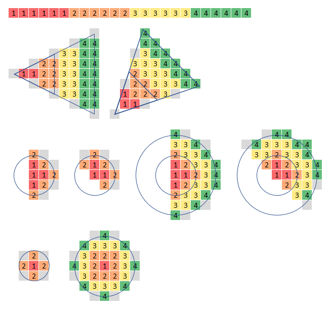

# 源石技艺

泰拉世界的大地被起因不明的天灾四处肆虐，经由天灾席卷过的土地上出现了大量的神秘矿物——被人们称为“源石”。在将源石中蕴含的能量投入工业生产的同时，在这个世界也存在着一种并不神秘的技术——源石技艺。

> &emsp;&emsp;*源石被发现之后，人们发掘出一种通过它来施放一系列令物质改变原有性状的技术，这种技术被称为源石技艺，常被俗称为“法术”。源石技艺所运用的能源，一般被认为来自于源石本身。而人是否能施放法术，以及所能施放法术的形式、强度、效果等，通常受到先天具备的素质、后天对源石技艺的学习能力这两方面因素的制约。*

掌握源石技艺的人通常被称为术士。通过手中镶嵌着源石的法杖，他们可以轻易凝聚火焰，冻结坚冰，震撼大地；在战场上将敌人烧作灰烬，或是为友方恢复伤口，抑或是化作坚盾抵挡攻击。

## 法术系统

在泰拉世界上，许多拥有悠久历史的文化都有着自己对于源石技艺的传承，这些传承往往是术士之间不断钻研理论而得出的成果，并作为施展源石技艺的基础形式流传给后人。这些流传下来的成体系理论被称为法术系统。

<blockquote><i>

    &emsp;&emsp;“雷法”，是在炎国流传的一种操作电现象的源石技艺。许多种成体系的源石技艺都有相应的传承系统，莱塔尼亚用乐章表现，萨卡兹人通过仪式引领，各个术师公会协会不断钻研各式理论，实际上都是为了将源石技艺的理论与实践成果传递下去。
    

    ——惊蛰，干员档案
    
</i></blockquote>

在本规则书中，法术系统并不会直接影响法术的效果，而仅仅作为干员背景的补充与角色扮演的一部分应用在游戏中。在施放法术时，你也可以选择扮演出术士所使用的源石技艺系统，以此增加游戏的趣味性与代入感。

此处简单对三种泰拉世界中目前来看较为主流的法术系统进行介绍：

- **莱塔尼亚**：源自莱塔尼亚术士公会的音乐源石技艺恐怕是泰拉世界上最广为流传的法术系统。莱塔尼亚的术士可以通过吟唱乐章来激发源石的能量，借此施放法术。通常来说，一节歌声或是一段旋律便足以引发法术效应。

- **卡兹戴尔**：卡兹戴尔的源石技艺源自古老的萨卡兹仪式，一般来说只有萨卡兹人才能掌握这种源石技艺。萨卡兹术士可以通过某种仪式性的动作完成法术的施放，这可以是一个手势，或是一段舞蹈仪式。

- **炎国**：目前我们对炎国的源石技艺所知甚少，但可以确定的是这项技艺也仅在炎国进行传承。炎国术士所掌握的是类似于道术的源石技艺，这种技艺通过符咒与经文来施放法术。

## 施法媒介

所有的术士在施法的过程中都需要源石的辅助，而一旦离开源石辅助，法术的使用效率便会大幅下降。对于感染者术士来说，他们可以利用自身体内的源石进行施法；而非感染者术士便需要借助一种特殊的施法媒介——法杖。

法杖是一类内部镶嵌着源石阵列的特殊装备，可以起到辅助源石技艺，甚至增强法术效果的作用。部分法杖内部的源石阵列经过精心调整，使其能够对特性类型的源石技艺进行增幅，使术士能够发挥出更多的潜力。法杖的实际样式多种多样，它可以是一根手持的短棍，也可以是一人多高的长杖。甚至远程控制源石炸药引爆的遥控器，也可以被称为法杖。而大部分的源石武器，实质上也是法杖的一种形式。

如果非感染者术士被缴械了，这通常意味着他们不再能够调用源石技艺、运用法术。而对于感染者术士来说，虽然他们可以通过体内的源石结晶进行施法，但这很可能会加速矿石病的恶化。只有最紧急的情况下，或是那些全然不顾自身的疯子才会只使用体内的源石进行施法。

## 源石技艺专精

泰拉世界上的源石技艺样式繁多，术士自身素质的不同也导致了法术具有各不相同的表现形式；而自漫长历史演化出的不同法术流派所使用的不同源石技艺系统，则更使得从施法原理来将法术进行分类变得异常困难。

在本规则书中，根据不同法术在战斗场景中的具体效用，将各类源石技艺统一归类为四个大类：塑能、防护、辅助、与医疗。

一般情况下，一名术师只能从四项源石技艺中选择一项作为专精类别，并为其提升专精等级，但除此之外，源石技艺适应性下还有一项“源石武器”专精，为源石武器专精提升专精等级则不受限制。

### 塑能类源石技艺

作为最基础的源石技艺，所有进行了一定程度的训练的术士都能使用塑能类源石技艺。塑能类源石技艺体现为对爆发性源石能量的操控，通过引导庞大的能量来对敌人进行直接杀伤。除了战斗中对敌人的直接杀伤之外，这类技艺也可以被用于一些特殊场合，如破开紧锁的大门，击碎障碍等等。

### 防护类源石技艺

防护类源石技艺体现为操纵能量以提供庇护。实现防护的形式多种多样，但其目的皆是抵御具有威胁性的攻击，以保护目标不受伤害。

### 辅助类源石技艺

辅助类源石技艺体现为对利用自身的源石技艺削弱敌方，对友方进行强化，或是探知周围的环境等等。这类源石技艺虽然不能直接造成杀伤或形成防御，但却能做到侦察敌对单位，限制敌人以辅助攻击，制造幻觉或是精神影响等等对团队有益的效果。

### 医疗类源石技艺

通过将自身的法术天赋和源石的力量结合在一起，萨卡兹人开发出了能够治愈他人的源石技艺，这被称为医疗类源石技艺。虽然医疗类源石技艺做不到起死回生，恢复断肢这种程度的治疗，但在医疗器械和药物的协助下，依旧能极大程度地保证干员在战场上的生还率。

由于医疗类源石技艺很大程度上与术士自身的医学造诣有关，你的**源石技艺（医疗）**专精等级不能高于**医术**等级。

### 源石武器

通过源石技艺与工业科技的精妙结合，一种特殊的装备应运而生，这便是源石武器。这类装备通过镶嵌精密排列的源石阵列，能够在使用时产生与法术几乎相同的效果。使用源石武器虽然也需要一定程度的源石技艺，但相比成为术士所需的大量学习过程，这已经大大降低了其使用难度。

所有源石武器都需要拥有一定的**源石技艺适应性（源石武器）**专精等级，这在铳械中体现为铳芯难度。任何低于该要求的角色都视作无法正确地激活武器中的源石核心，从而无法使用源石武器所具有的能力。

## 表现形式

法术作为一种通过激发源石内能量以进行杀伤的技术，其能量的表现形式也是多种多样的。有的术士能够凝聚巨大的火球，制造极高的热量燃尽敌人；有的术士能呼唤风雪，将刺骨的严寒灌进敌人的脊椎；而有的术士则仅仅是将能量凝成尖矛与利刃，将敌人凌迟致死。

在本规则中，法术的表现形式被称为属性，法术属性的不同将会影响到源石技艺的伤害类型，同时也会对敌人施加不同的额外效果。根据表现形式的不同，法术分为力场，火焰，寒冰，岩石，电能五种属性，每种属性都有对应的法术类型限制与附加效果，具体如下：

- **力场**：力场是被术士以源石技艺塑造成型的纯粹源石能量。通过术士的操作，力场法术可以化作无形的利剑、迅猛的巨锤，也可以是战友身前的能量坚盾。除此之外，一部分辅助类源石技艺与所有医疗类源石技艺也属于力场属性。

  力场属性的塑能类法术可以造成穿刺、钝击、割裂三种物理伤害与冲击伤害，辅助类法术可以提供物理赋形，而防护类法术则可以提供冲击与物理防护。

- **岩石**：岩石法术是往往是较为朴实无华的，一块小小的石头或许不能有什么作为，但在术士手中，它就是一枚高速运动的凶器。岩石法术体现为对常见矿物的操作，化零为整，化整为零。

  岩石属性的塑能类法术可以造成物理伤害，并且可以为攻击附加击晕或粉碎效果；辅助类法术可以提供岩石赋形，而防护类法术则可以提供物理与冲击防护。

- **火焰**：火焰法术或许是战场上最引人注目的法术。通过使用源石技艺操作环境中的热能，使用这类法术的术士常常能够制造冲天的火光，将整片战场化作火海。

  火焰属性的塑能类法术可以造成燃烧伤害与冲击伤害，或是施加引燃效果；辅助类法术可以提供火焰赋形以及驱散冻伤，而防护类法术则可以提供冰冻防护。

- **寒冰**：寒冰法术通常很冷（这是冷笑话）。与火焰法术相反，寒冰法术体现为对环境中的分子内能的剥夺，这使得术士能够制造极端的严寒环境使缺乏防护的敌人寸步难行，亦或者凝聚冰晶，让敌人体会什么叫真正的“彻骨严寒”。

  寒冰属性的塑能类法术可以造成物理伤害与冰冻伤害，或是施加冻伤效果；辅助类法术可以提供寒冰赋形以及抵抗引燃，而防护类法术则可以提供物理与燃烧防护。

- **电能**：电能法术体现为对环境中电荷的操作，从而产生强烈的电流与电击。伴随着电弧击穿空气的刺耳巨响与耀眼的闪光，操作电能的术士会让他们的敌人体会到什么叫雷霆万钧之势。

  电能属性的塑能类法术可以造成电击伤害，同时可以使敌人陷入眩晕状态；辅助类法术可以提供电能塑形，而防护类法术则可以提供电击防护。

源石技艺的特性决定了一名术士一般来说只能施放一种属性的法术，这被称为这名术士的法术属性。但具有特殊源石技艺适应性天赋或是经受过训练的术士也可以施放多种属性的法术。

当施放属性与术士自身的法术属性不同的法术时，进行的源石技艺检定无法获得专精带来的奖励骰，同时法术效力也不计算相应的专精等级（见下文）。

## 构筑法术

术士通过自己的源石技艺来控制源石中蕴含的能量，并以此以各种不同的方式改变物质的性状，这就是法术最基本的原理。而能否精确地控制源石的能量，能否掌握更强的源石技艺，则依赖于术士自身的天赋与后天的学习。

源石技艺具有不同的运用方式，而即便拥有天赋，使用它们同样需要长年累月的学习与练习。术士在源石技艺上天赋体现为他/她的源石技艺适应性能力等级，而施放法术所能产生的效果则会受到术士该类法术的法术效力的影响：

法术效力（专精）= <strong>源石技艺适应性</strong> + <strong>专精</strong>

一个法术由动作，距离，范围，持续时间，与效应五种基础要素组成，在施放法术时，每一种基础要素都需要一定的法术效力，五项要素总共所需的法术效力被称为法术的技艺等级。

一名术士不能施放技艺等级高于自身法术效力的法术，而在构筑法术时，也请务必注意法术所需的法术效力是否超过了术士自身的极限。在构筑法术时，你可以将法术效力看作购买不同词条的“货币”，通过消耗法术效力来为你自己的法术添砖加瓦，从而形成多种多样的效果。

### 法术位

虽然一名术士可以自由地构筑不同类型的法术，但在战斗中，你的敌人不一定会给你慢慢构筑法术的时间。因此，那些经过战斗训练的术士往往会准备好几个自己熟知的法术，以便在战斗中及时施放。

一名术士所拥有的法术位数量等于他/她的**源石技艺适应性**等级，你可以将自行构筑的塑能法术，以及其它法术类型中的某一个效应添加到法术位中。在施放法术位中的法术时，不会受到惩罚，而在施放临时构筑的法术时，所能使用的法术效力-2。

### 施法动作

法术的动作要素是准备法术所需的时间，在战斗中体现为需要消耗的行动类型。准备施法所需的时间越长，需求的法术效力越少：

**表6-1：施法动作**

| 行动类型 | 法术效力需求 |
| :------: | :----------: |
|   次要   |      +4      |
|   主要   |      +2      |
|   1轮    |      +1      |
|   2轮    |      0       |
|  更多轮  |    每轮-1    |

 

- **次要**的施法动作表示法术需要一个次要行动来进行施放，这类法术往往较为简单，仅仅需要一声口令或是一句咒语便能施放；

- **主要**的施法动作表示法术需要一个主要行动来进行施放，这类法术的施放可能会包含一些肢体动作，或是较长的吟唱；

- **1轮**及**2轮**的施法动作表示法术需要1或2个整轮来进行准备，此时法术将会在术士宣布施放法术的1或2整轮后自身的回合开始时起效。如果术士在准备法术的过程中受到了任何形式的伤害，则需要进行一次难度为**10**的**生理耐受（意志）**检定，再次受到伤害则检定难度+4，以此类推。如果检定失败则意味着法术施放失败。此外，当术士不论因为何种原因陷入眩晕或休克状态时，法术施放也会失败；

- **更多轮**的施放动作表示法术需要3轮乃至更长的时间进行准备，需要准备的时间越长，也就意味着法术的效果越强。此时法术将会在术士准备完成后自身的回合开始时起效。一名术士最多能够花费等同于自身**源石技艺适应性**等级的轮次准备法术。如果术士在准备法术的过程中受到了任何形式的伤害，则需要进行一次难度为**10**的**生理耐受（意志）**检定，再次受到伤害则检定难度+4，以此类推。如果检定失败则意味着法术施放失败。此外，当术士不论因为何种原因陷入眩晕或休克状态时，法术施放也会失败。

### 施法距离

法术的距离是单体法术所能达到的最远距离，或是范围法术源点位置的最远距离。法术的距离越长，需求的法术效力越多：

**表6-2：施法距离**

| 距离 | 法术效力需求 |
| :--: | :----------: |
| 自身 |      0       |
| 触及 |      0       |
| 远程 |   每10米+1   |

- **自身**距离表示法术的目标为术士自己，这通常应用于一些辅助类与防护类法术。

- **触及**距离表示法术的目标或能量爆发的源点在术士的手所能够触碰的范围内，一些近距离的塑能法术可以在触及距离内释放。

- **远程**距离表示法术的目标处于术士的触及范围之外，目标可以是一个角色，也可以是空间中的某一点。

### 效应范围

法术的效应范围是法术能量所能覆盖的区域大小。规定法术的覆盖区域通常需要规定一个源石能量的爆发点，这被称为源点，以及能量能够扩散的距离。法术扩散的距离越大，需求的法术效力越多：

**表6-3：效应范围**

| 形状范围 |   源点   | 法术效力需求 |
| :------: | :------: | :----------: |
|   单体   |    -     |      +1      |
|   线状   |   触及   |   每5米+1    |
|   锥状   |   触及   |   每2米+1    |
|   半球   |   触及   | 半径每1米+1  |
|   球状   | 施法距离 | 半径每1米+2  |
|   领域   |   自身   |   每5米+1    |

- **单体**效应范围表示法术只能作用于一个单体目标。在施放时，术士需要为法术指定一个目标，这个目标可以是一名角色或是物体，但其必须在施法距离内，并且为术士可视。

- **线状**效应范围表示法术会以术士的触及距离作为源点，向特定方向爆发出长宽固定的范围源石能量。

- **锥状**效应方位表示法术会以术士的触及距离作为源点，向特定方向以锥形扩散。该锥状区域的最大宽度等于扩散距离的长度。

- **半球**效应范围表示法术会以术士的触及距离作为源点，向特定方向以特定半径的半球形扩散。

- **球状**效应范围表示法术会以术士施法距离内选定的一个点作为源点，向四周特定半径的球形空间进行扩散。

- **领域**效应范围是一种特殊的法术类型。当使用此类效应范围时，法术会以术士自身为源点，想四周特性半径的球形空间进行扩散，但所能产生的效应减半。

?> **注：**在施法范围与效应范围两节中，“每x**米+y**”的距离与法术效力需求代表了只要距离大于0**（那就是自身/**触及距离及单体范围）且小于等于x**，便需要y**点法术效力。

#### 范围法术

当使用格子地图时，范围法术投入的法术效力与对应的伤害范围可以参考下图。在结算法术的效应范围时，可以有半数的灰色格子被囊括入效应范围。

### 持续时间

持续时间为法术生效的时间长短。当法术施放后，其效果将会一直持续，直到持续时间结束或是法术被破坏。法术生效的时间越长，所需的法术效力越多：

**表6-4：持续时间**

|  持续时间   | 法术效力需求 |
| :---------: | :----------: |
| 瞬间/一回合 |      0       |
|    一轮     |    每轮+1    |
|    专注     |      +1      |

 

- **瞬间/一回合**的持续时间表示法术仅在术士施放法术的那一瞬间或术士的当前回合生效，当法术结算完成或是术士的当前回合结束，法术便会停止生效。

- **一轮**的持续时间表示法术将会自术士施放法术起持续六秒，即在术士的下一个回合开始时停止生效。

- **专注**的持续时间表示术士将持续投入精力以维持法术，法术将会持续维持直到术士失去专注。一名术士同时只能维持一个专注法术，但可以随时取消专注状态。在战斗中，维持专注视为术士每轮使用了一个次要的交互类行动。当术士在专注状态下受到伤害时，需要进行一次难度为**10**的**生理耐受（意志）**检定，如果失败则会取消专注状态。当术士不论因为何种原因陷入眩晕或休克状态时，专注状态也会取消。

## 法术效应

法术的类型主要分为四类：塑能，防护，医疗，与辅助，分别对应了四种专精的类型。不同类型的法术具有截然不同的法术效应。例如塑能法术可以将能量化作利刃杀伤敌人，却不能形成坚盾为他人提供保护。

除了法术效应所对应的类型之外，有些法术效应也仅适用于一些限定类型的表现形式。例如，你无法施放一个表现形式为电能法术，但却能够抵挡物理伤害的护盾法术。

法术所能产生的效果与强度和对其投入的法术效力息息相关，在法术效力这一部分中，你可以自由选择同一种类型下的不同词条来构筑法术。在选择词条时，你可以选择多个不同的词条来为你的法术赋予多种效果，也可以多次选择同一词条来使其具有更高的等级与更强的效果。

### 塑能法术

当施放一个塑能法术时，所需的检定类型需要根据法术的效应范围来决定。如果效应范围为单体，使用**战斗技巧（施法）**检定，检定难度为目标的战斗防御（闪避）。如果施放触及距离的法术，目标也可以使用战斗防御（格挡）作为检定的难度。对于非单体效应范围的法术，使用**源石技艺适应性（塑能）**检定，检定难度为**10**。如果在施放法术的检定中得到了大成功或更高的成功等级，则法术效果中的加粗数字乘以成功系数。

**表6-5：塑能法术效应**

| 效应名称 | 法术效果                                                     | 法术效力需求 |
| -------- | :----------------------------------------------------------- | ------------ |
| 尖刺塑能 | **1**d3穿刺伤害（力场）-（岩石）粉碎（寒冰）冻伤1            | 1            |
| 重锤塑能 | **1**d3钝击伤害（力场）-（岩石）粉碎（寒冰）冻伤1            | 1            |
| 利刃塑能 | **1**d3割裂伤害（力场）-（岩石）粉碎（寒冰）冻伤1            | 1            |
| 爆炸塑能 | **1**d6冲击伤害（力场）击退**2**（火焰）击退**1**，引燃**1**（电能）击退**1**，麻痹**1** | 2            |
| 冲击塑能 | （力场）击退**2**                                            | 1            |
| 烈焰塑能 | （火焰）**1**d3燃烧伤害，引燃**2**                           | 2            |
| 灼热塑能 | （火焰）引燃**2**                                            | 1            |
| 冰霜塑能 | （寒冰）**1**d3冰冻伤害，冻伤**2**                           | 2            |
| 寒冷塑能 | （寒冰）冻伤**2**                                            | 1            |
| 雷电塑能 | （电能）**1**d3电击伤害，麻痹**2**                           | 2            |
| 感电塑能 | （电能）麻痹**2**                                            | 1            |

 

?> **例：**一名源石技艺适应性等级优良，塑能专精等级3的术士干员想要制造一个小型爆炸，那将会造成冲击伤害，并为受到伤害的敌人附加引燃效果。为此，她构筑了这样一个法术： &emsp;&emsp;**类型**：塑能 &emsp;&emsp;**表现形式**：火焰 &emsp;&emsp;**技艺等级**：7 &emsp;&emsp;&emsp;&emsp;- **动作**：主要【2】 &emsp;&emsp;&emsp;&emsp;- **距离**：10米【1】 &emsp;&emsp;&emsp;&emsp;- **范围**：球状，半径1米【2】 &emsp;&emsp;&emsp;&emsp;- **持续时间**：瞬间【0】 &emsp;&emsp;&emsp;&emsp;- **法术效应**：冲击塑能1【2】  &emsp;&emsp;*法术效应中的冲击塑能1代表这名干员在构筑法术时选用了1级冲击塑能法术效应。因此，这个法术将会以10米内为该干员可见的一点为源点制造一个高热的爆炸，对半径1米内的角色造成基础1d6点的冲击伤害，同时为受到伤害的角色增加1点灼热值，并造成2米的击退效果。* &emsp;&emsp;*由于这个法术是范围法术，该干员在施放法术时需要进行**源石技艺适应性（塑能）**检定。如果在检定中得到了大成功，则法术将会造成的伤害改为2d6点冲击伤害。*

### 防护法术

当施放一个防护法术时，进行一次难度为**10**的**源石技艺适应性（防护）**检定，如果成功，则视为法术起效。如果得到了大成功或更高的成功等级，则法术效果中的加粗数字乘以成功系数。

**表6-6：防护法术效应**

| 效应名称 |                           表现形式                           | 法术效果                                                     | 法术效力需求 |
| :------: | :----------------------------------------------------------: | :----------------------------------------------------------- | :----------: |
| 法术掩护 |                             力场                             | 在目标受到物理或冲击伤害时，伤害-**1**                       |      1       |
|   岩石   | 在目标受到物理伤害时，伤害-**1** 在目标受到冲击伤害时，伤害-**2**，并且被击退距离-**2** | 1                                                            |              |
|   火焰   |               在目标受到冰冻伤害时，伤害-**2**               | 1                                                            |              |
|   寒冰   | 在目标受到物理伤害时，伤害-**1** 在目标受到燃烧伤害时，伤害-**2** | 1                                                            |              |
|   电能   |               在目标受到电击伤害时，伤害-**2**               | 1                                                            |              |
| 强硬抵御 |                             力场                             | 目标的战斗防御（格挡）+**1**                                 |      2       |
| 闪烁幻影 |                             力场                             | 目标的战斗防御（闪避）+**1**如果目标在法术生效时进行了任何的攻击动作，则会使法术立即失效 |      2       |
| 效应驱散 |                             火焰                             | 驱散**1**层冻伤效果                                          |      3       |
|   寒冰   |                     驱散**1**层引燃效果                      | 3                                                            |              |
|   电能   |                     驱散**1**层麻痹效果                      | 3                                                            |              |
| 环境恢复 |                             火焰                             | 降低**2**点灼热值                                            |      1       |
|   寒冰   |                      降低**2**点寒冷值                       | 1                                                            |              |
|   电能   |                      降低**2**点感电值                       | 1                                                            |              |

### 辅助法术

当施放一个辅助法术时，如无特殊说明，进行一次难度为**10**的**源石技艺适应性（辅助）**检定，如果成功，则视为法术起效。如果得到了大成功或更高的成功等级，则法术效果中的加粗数字乘以成功系数。

**表6-7：辅助法术效应**

| 效应名称 |                     表现形式                     | 法术效果                                                     | 法术效力需求 |
| :------: | :----------------------------------------------: | :----------------------------------------------------------- | :----------: |
| 武器赋形 |                       力场                       | 从穿刺、钝击、割裂中选择一类伤害类型为武器进行赋形，武器对应类型的物理伤害额外+**1**，并且获得伤害类型的对应特性（破甲，击晕，流血） |      1       |
|   岩石   | 武器的物理伤害额外+**1**，并且获得粉碎及笨重特性 | 1                                                            |              |
|   火焰   |  武器在进行攻击时额外造成**1**点燃烧伤害，引燃1  | 2                                                            |              |
|   寒冰   |  武器在进行攻击时额外造成**1**点冰冻伤害，冻伤1  | 2                                                            |              |
|   电能   |  武器在进行攻击时额外造成**1**点电击伤害，麻痹1  | 2                                                            |              |
| 灵巧步伐 |                       力场                       | 目标所有的战场机动检定结果+**1**，并且在移动中离开敌方角色的攻击范围时不会触发借机攻击。 |      2       |
| 身轻如燕 |                       力场                       | 目标的冲锋与移动时无视障碍物与危险地形带来的影响             |      1       |
| 环境探知 |                       力场                       | 得知法术范围内存在的生物数量与位置。如果在法术范围内存在处于潜行状态的角色，则检定难度改为潜行者的潜行值– **1** |      2       |
| 认知阻碍 |                       力场                       | 潜行状态下的目标潜行值+**1**                                 |      2       |
| 限制移动 |                 力场，岩石，寒冰                 | 使用本法术时，检定难度为目标的战斗防御（闪避）。受影响的目标进入束缚状态。被束缚者解除束缚的难度+**1**。 |      2       |

?> **注：**如果以范围法术施放限制移动法术，法术仅在施放时对范围内的目标造成影响，而后续进入法术范围的角色则不会受影响。如果在施放时法术范围内存在多个目标，则仅进行一次检定，将检定结果与每个目标的战斗防御（闪避）进行对比。

### 医疗法术

当施放一个医疗法术时，如无特殊说明，进行一次难度为**10**的**医术（法术治疗）**检定，如果成功，则视为法术起效。如果得到了大成功或更高的成功等级，则法术效果中的加粗数字乘以成功系数。

**表6-8：医疗法术效应**

| 效应名称 | 表现形式 | 法术效果                                                     | 法术效力需求 |
| :------: | :------: | ------------------------------------------------------------ | :----------: |
| 精力充盈 |   力场   | 目标在法术持续时间内获得**1**点额外体力值。获得的额外体力值可以超过当前的体力值上限。 |      1       |
| 疗愈之力 |   力场   | 目标恢复**1**点体力值，并解除1层流血状态                     |      2       |
| 维生力场 |   力场   | 当目标需要进行任何**生理耐受**检定时，检定结果+**1**         |      1       |
| 辅助疗法 |   力场   | 当需要进行**医术（法术治疗）**以外的医术检定时，进行一次相同难度的**医术（法术治疗）**检定， 如果成功，则可以为本次医术检定赋予等同于**源石技艺适应性（医疗）**专精等级数量的奖励骰。 如果得到了大成功，则改为使本次医术检定+1D； 如果得到了极大成功，则改为+2D。 |      4       |

## 施放法术

在构筑好法术之后，在进行施法时，仍需明确法术的目标，并根据目标的不同进行相应的施法检定。

### 施法目标

大部分法术都需要指定一个施法目标，单体法术需要指定一个单体作为目标，而范围法术则需要指定法术能量的爆发源点。指定的施法目标可以是生物，物体，也可以单纯是空间中的某一点。当然也可以指定自身为施法目标。另外，对于范围法术来说，除了塑能法术外的法术可由术士选择仅影响敌人或我方角色。

当指定施法目标时，术士与目标之间必须不能有任何阻挡。这意味着你不能以一个位于全身掩体后的目标作为施法目标，也不能将范围法术的源点设置为掩体后或护甲下的一点。

### 施法检定

在战斗中进行施法往往会受到来自各方面因素的干扰，因此也只有受到过一定军事训练的术士才能在战场上正常地施术。如果术士的**战斗技巧（施法）**专精等级没有达到2级，则所有的施法检定仅能以普通能力等级进行。

根据法术的目标不同，施法所需要的检定也各不相同。一般来说，造成范围伤害的塑能法术，或是以友方为目标的法术的施法检定为**源石技艺适应性（专精）**，医疗法术的施法检定为**医术（法术治疗）**，此时检定得到更高的成功等级可以获得更强的效果；而当施放以单体敌人为目标的法术时，施法检定改为**战斗技巧（施法）**，检定难度改为目标的战斗防御，在这种情况下，如果得到了大成功或更高的成功等级，如同一般的攻击方式一样，将造成的伤害乘以对应的成功系数。

## 源石武器

通过源石技艺与工业科技的精妙结合，一种特殊的装备应运而生，这便是源石武器。这类装备通过镶嵌精密排列的源石阵列，能够在使用时产生与法术几乎相同的效果。使用源石武器虽然也需要一定程度的源石技艺，但相比成为术士所需的大量学习过程，这已经大大降低了其使用难度。但相对的，源石武器所能使用的法术也是固定的，而其上的源石阵列一旦受损，就不再能够使用。源石武器造价也相当昂贵，只有少部分大型企业或组织才负得起装配这类武器的开销。干员暴行使用的战术爆破攻坚锤，干员雷蛇的闪光盾，以及干员能天使所使用的铳械，都属于源石武器。

**装备分级**

所有类型的源石武器都会要求极其特殊的使用技巧与相应的训练，因此源石武器在装备分级中属于特殊装备。这意味着在使用源石武器时，如果对应的**战斗技巧**专精没有达到2级，则仅能以缺陷能力等级进行检定。

### 源石核心等级

由于源石与武器的结合方式多种多样，在此不做具体的种类要求。但所有源石武器都需要拥有一定的**源石技艺适应性（源石武器）**专精等级要求，这在铳械中体现为铳芯等级。

源石武器的强度与其源石核心等级成正比，而任何**源石武器**专精等级低于该要求的角色都视作无法正确地激活武器中的源石核心，从而无法使用源石武器所具有的能力。